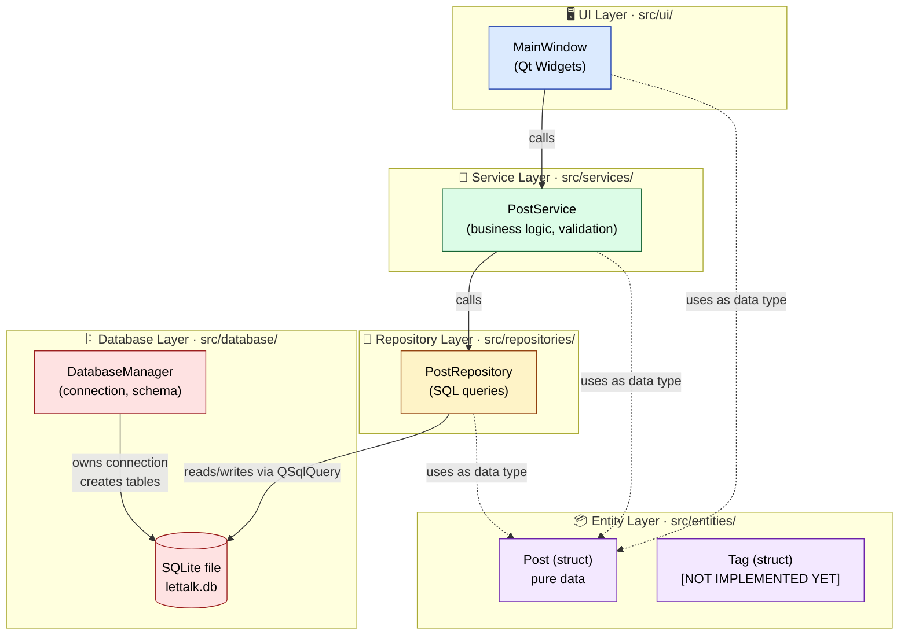
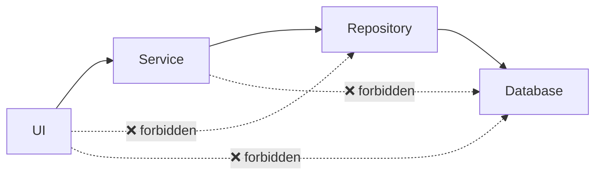

# 1. Architecture Overview

## The big picture

LetTalk Content Studio is built as a **layered architecture**. Each layer has *one* responsibility
and is only allowed to talk to the layer *directly below it*.



- **Solid arrows** = "calls" (a runtime function call).
- **Dotted arrows** = "uses as a data type" (just a `struct` reference, not a function call).

---

## The five layers

### 🖥️ 1. UI Layer — `src/ui/`

> **Spring Boot analogy:** `@Controller`. **NestJS analogy:** `@Controller`. **Android analogy:** `Activity` / `Fragment`.

The UI layer is what the user **sees and clicks**. In Qt, it is made of `QWidget` subclasses —
windows, buttons, text editors, list views. The single class here today is `MainWindow`.

**Its job:**
- Render data on screen.
- Listen to user actions (clicks, typing, keyboard shortcuts).
- Translate those actions into calls to the **Service** layer.
- Translate the data returned by the Service back into widgets.

**What it must NOT do:**
- ❌ Run SQL queries directly.
- ❌ Validate business rules ("title must not be empty" — that's a Service concern).
- ❌ Know what database engine is in use.

> 💡 **Why?** Imagine LetTalk decides next year to add a **web** version. If the UI does
> not contain business logic, the entire `PostService` and `PostRepository` can be reused
> by the web version. Only the UI gets rewritten.

---

### 🧠 2. Service Layer — `src/services/`

> **Spring Boot analogy:** `@Service`. **NestJS analogy:** `@Injectable()` service. **Clean Architecture name:** "Use Case".

The Service layer is **the brain** of the application. This is where the *rules of the business*
live: what counts as a valid post, when to set `updatedAt`, what should happen when you delete
a post that has tags attached, etc.

**Its job:**
- Validate inputs from the UI (`title must not be empty`, `id must be > 0`).
- Set bookkeeping fields (`createdAt`, `updatedAt`).
- Orchestrate one or more Repository calls. (Example: "publish a post" might mean *update* the post AND *insert* a row in a `publication_log` table.)
- Return a meaningful result to the UI (success / failure / data).

**What it must NOT do:**
- ❌ Touch `QSqlQuery` or any SQL string.
- ❌ Touch any `QWidget` or Qt UI class.

```cpp
// A good service method looks like this — it reads as a list of business steps.
bool PostService::createPost(Post &post)
{
    if (post.title.isEmpty()) return false;             // ← business rule
    const auto now = QDateTime::currentDateTimeUtc();
    post.createdAt = now;                                // ← bookkeeping
    post.updatedAt = now;                                // ← bookkeeping
    return m_repository.save(post);                      // ← delegate to repository
}
```

---

### 💾 3. Repository Layer — `src/repositories/`

> **Spring Boot analogy:** `@Repository` (a.k.a. DAO — Data Access Object). **NestJS analogy:** `*.repository.ts` with TypeORM.

The Repository layer is the **only place in the entire codebase where SQL is written**. Every
method here corresponds to one operation against a single table.

**Its job:**
- Translate from **C++ objects ↔ SQL rows**.
- Use prepared statements (`query.prepare()` + `query.bindValue()`) — never string concatenation, because of SQL injection.
- Return either a populated `Post` entity or a clear failure (`return Post{}`, `return false`).

**What it must NOT do:**
- ❌ Validate business rules.
- ❌ Decide *what* to do — only *how* to talk to the database.

> 💡 **Why the rigid separation?** If the team wants to write **unit tests** for `PostService`,
> they can swap the real `PostRepository` with a fake in-memory one. No database needed. Tests
> run in milliseconds.

---

### 🗄️ 4. Database Layer — `src/database/`

> **Spring Boot analogy:** `DataSource` + Flyway migrations.

The Database layer is a **thin** layer responsible for two things:

1. **Opening the connection** to SQLite (`QSqlDatabase::addDatabase("QSQLITE")`).
2. **Creating the schema** when the app starts (`CREATE TABLE posts (...)`).

That's it. Once the connection is open, `QSqlQuery` (used by the Repository) automatically
uses the default connection. The `DatabaseManager` doesn't sit *between* the Repository and
SQLite at runtime — it sets things up and gets out of the way.

> 💡 In a production setup, this layer would also handle **migrations** (versioned schema
> changes). For LetTalk we currently `DROP TABLE IF EXISTS posts` on every start — easy for
> learning, but you'll replace that with real migrations in Sprint 4.

---

### 📦 5. Entity Layer — `src/entities/`

> **Spring Boot analogy:** `@Entity` / `record`. **NestJS analogy:** `*.entity.ts` POJO.

Entities are **pure data**. A `struct` with fields. No methods (other than maybe a constructor),
no SQL, no Qt UI code.

```cpp
struct Post {
    int id = -1;
    QString title;
    QString category;
    QString content;
    QDateTime createdAt;
    QDateTime updatedAt;
};
```

This is the **shared vocabulary** of the application: the UI, the Service and the Repository
all speak in terms of `Post`. Because it carries no logic, it can be passed between layers
freely without creating coupling.

> 💡 **Why a `struct` and not a `class`?** In C++, `struct` and `class` are nearly identical —
> the only difference is the default access (`public` vs `private`). For pure data containers,
> `struct` signals to the reader: "this has no encapsulation to worry about — it's just fields".

---

## The Golden Rule

> **Every layer may only depend on the layer directly below it.**



If you ever feel tempted to call `PostRepository` directly from `MainWindow` to "save one
line", **stop**. The whole reason the architecture works is that this rule is *never broken*.

---

## Why bother? The four benefits

| Benefit | Concretely |
|---------|-----------|
| **Testability** | `PostService` can be tested without ever starting Qt or opening a DB. Substitute a fake repository, assert the logic. |
| **Maintainability** | Want to switch from SQLite to MySQL? Only `PostRepository` and `DatabaseManager` change. The UI doesn't even recompile (in spirit). |
| **Reusability** | The Service + Repository pair could be wrapped in a command-line tool, a web server, or a mobile app without changes. |
| **Industry standard** | This is the same architecture you'll meet in every serious C++/Java/C# codebase. Learn it once, use it everywhere. |

---

➡️ Next: [`02-data-model.md`](02-data-model.md) — the entities and the database schema in detail.
