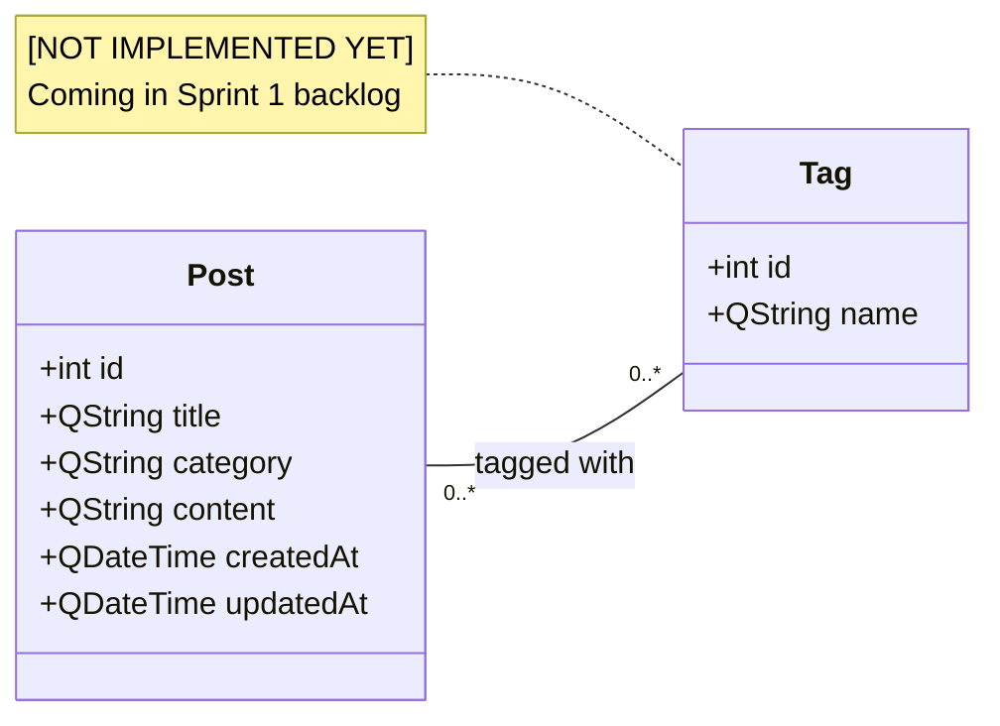
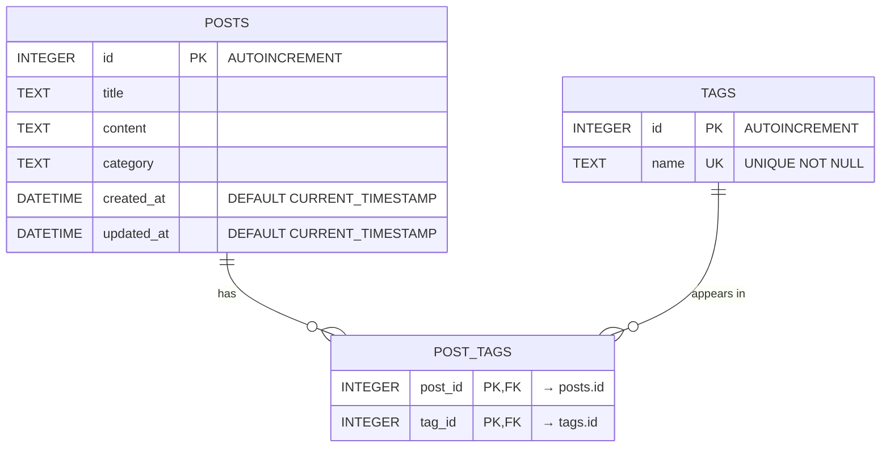
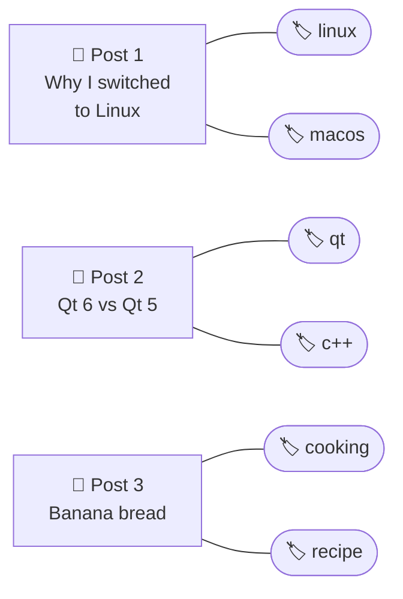

# 2. Data Model — Entities, Tables, Relations

This document describes **what data the application stores** and **how it is structured**.
You already know SQL and UML — this should feel familiar.

---

## 2.1 The entities (UML class diagram)

Entities are the **C++ representation** of a database row. Each `struct` field maps directly
to a column in the corresponding table.



- **Multiplicity `0..* — 0..*`** means: a post can have many tags, and a tag can be attached
  to many posts. This is a **many-to-many** relation. In a relational database, many-to-many
  is always implemented with a **junction table** (also called a *join table*) — that's
  `post_tags` below.

---

## 2.2 The database schema (ER diagram)



### What the relationship symbols mean

| Symbol | Meaning |
|--------|---------|
| `\|\|--o{` | "one to zero-or-many" |
| `o\|--o{` | "zero-or-one to zero-or-many" |
| `}o--o{` | "zero-or-many to zero-or-many" |

So `POSTS \|\|--o{ POST_TAGS` reads: **one** post can have **zero or many** rows in
`post_tags`. The composite primary key `(post_id, tag_id)` on `post_tags` ensures the same
tag cannot be linked twice to the same post.

---

## 2.3 Why a junction table?

Suppose you tried to store tags directly in the `posts` table as a comma-separated string:

```sql
-- ❌ DON'T DO THIS
posts.tags = "linux,qt,c++"
```

You immediately get pain:

1. **Searching is slow.** Finding all posts with the `qt` tag requires a `LIKE '%qt%'` scan,
   which matches `qt6`, `pyqt`, etc.
2. **Renaming a tag is a nightmare.** Updating "qt" → "Qt" must `UPDATE` every post.
3. **Statistics are impossible.** "Top 10 tags by post count" needs the SQL engine to parse
   strings.

The junction table makes each tag-on-post link a real, indexable, joinable row.

---

## 2.4 Real-world example

Imagine these three creators are using LetTalk Content Studio:

> 💡 **Example data — three posts**

| id | title                         | category   | content (excerpt)          | created_at          | updated_at          |
|----|-------------------------------|------------|----------------------------|---------------------|---------------------|
| 1  | "Why I switched to Linux"     | Tech       | "After 10 years on macOS…" | 2026-05-10 09:30:00 | 2026-05-10 09:30:00 |
| 2  | "Qt 6 vs Qt 5: the gotchas"   | Tech       | "Migration tips…"          | 2026-05-11 14:12:00 | 2026-05-12 08:00:00 |
| 3  | "Banana bread, perfected"     | Cooking    | "300g flour, 2 eggs…"      | 2026-05-12 19:45:00 | 2026-05-12 19:45:00 |

> 💡 **Example data — six tags**

| id | name      |
|----|-----------|
| 1  | linux     |
| 2  | macos     |
| 3  | qt        |
| 4  | c++       |
| 5  | cooking   |
| 6  | recipe    |

> 💡 **Example data — the `post_tags` junction**

| post_id | tag_id |  meaning                          |
|---------|--------|-----------------------------------|
| 1       | 1      | Post #1 ("Linux") is tagged `linux`   |
| 1       | 2      | Post #1 is also tagged `macos`        |
| 2       | 3      | Post #2 ("Qt 6") is tagged `qt`       |
| 2       | 4      | Post #2 is also tagged `c++`          |
| 3       | 5      | Post #3 ("Banana bread") tagged `cooking` |
| 3       | 6      | Post #3 also tagged `recipe`          |

Visually, the connections look like this:



Every line in the diagram = one row in `post_tags`. Six rows total.

---

## 2.5 Querying the model — examples Daniel should be able to read

### "Give me all posts tagged `qt`"

```sql
SELECT p.*
FROM posts p
JOIN post_tags pt ON pt.post_id = p.id
JOIN tags t       ON t.id = pt.tag_id
WHERE t.name = 'qt';
```

Result on the sample data: post #2 ("Qt 6 vs Qt 5").

### "How many posts does each tag have?"

```sql
SELECT t.name, COUNT(pt.post_id) AS post_count
FROM tags t
LEFT JOIN post_tags pt ON pt.tag_id = t.id
GROUP BY t.id
ORDER BY post_count DESC;
```

Result:

| name    | post_count |
|---------|-----------|
| linux   | 1 |
| macos   | 1 |
| qt      | 1 |
| c++     | 1 |
| cooking | 1 |
| recipe  | 1 |

(Each tag is used by exactly one post in our example.)

### "Tag Post #2 with `cmake`"

Two steps — insert the tag (if it does not already exist), then link it:

```sql
INSERT OR IGNORE INTO tags(name) VALUES ('cmake');
INSERT INTO post_tags(post_id, tag_id)
  VALUES (2, (SELECT id FROM tags WHERE name = 'cmake'));
```

> 💡 `INSERT OR IGNORE` is SQLite syntax — if a `UNIQUE` constraint would fail, the row is
> silently skipped instead of raising an error. Convenient for "create-if-missing".

### "Delete post #2 — and clean up its tag links"

```sql
DELETE FROM post_tags WHERE post_id = 2;
DELETE FROM posts WHERE id = 2;
```

If `post_tags` had `ON DELETE CASCADE` on the foreign key (recommended), the first statement
would be unnecessary — deleting the post would cascade automatically. We enabled
`PRAGMA foreign_keys = ON` in `databasemanager.cpp`, so cascades **will** work once the
`FOREIGN KEY ... ON DELETE CASCADE` clauses are added to the table.

---

## 2.6 What lives in C++ vs in SQL?

| Concept               | C++ side (`src/entities/`) | SQL side (`databasemanager.cpp`) |
|-----------------------|----------------------------|----------------------------------|
| `Post` struct fields  | `int id`, `QString title`, `QDateTime createdAt`… | columns `id`, `title`, `created_at`… |
| `Tag` struct fields   | `int id`, `QString name`   | columns `id`, `name UNIQUE`      |
| The link between them | A field `QList<Tag> tags` on `Post` (planned) | The `post_tags` table |

The Repository's job is to **translate** between the two sides — see
[`postrepository.cpp`](../src/repositories/postrepository.cpp) where `toMap()` packs a `Post`
into `:title`, `:content`, … bind values, and `mapToPost()` does the reverse from a
`QSqlQuery` row.

---

## 2.7 State of the data model today

| Element              | Status | Where |
|----------------------|--------|-------|
| `Post` entity        | ✅ Implemented | `src/entities/post.h` |
| `posts` table        | ✅ Implemented | `databasemanager.cpp::createTables()` |
| `Tag` entity         | ❌ TODO Sprint 1 | will live in `src/entities/tag.h` |
| `tags` table         | ❌ TODO Sprint 1 | extend `createTables()` |
| `post_tags` junction | ❌ TODO Sprint 1 | extend `createTables()` |
| Foreign-key cascades | ❌ TODO | add `ON DELETE CASCADE` clauses |
| `Post.tags` field    | ❌ TODO (planned) | `QList<Tag>` on `Post` after Tag exists |

See [`BOARD.md`](../BOARD.md) for the live task list.

---

➡️ Next: [`03-class-diagram.md`](03-class-diagram.md) — how the C++ classes relate to each other.
