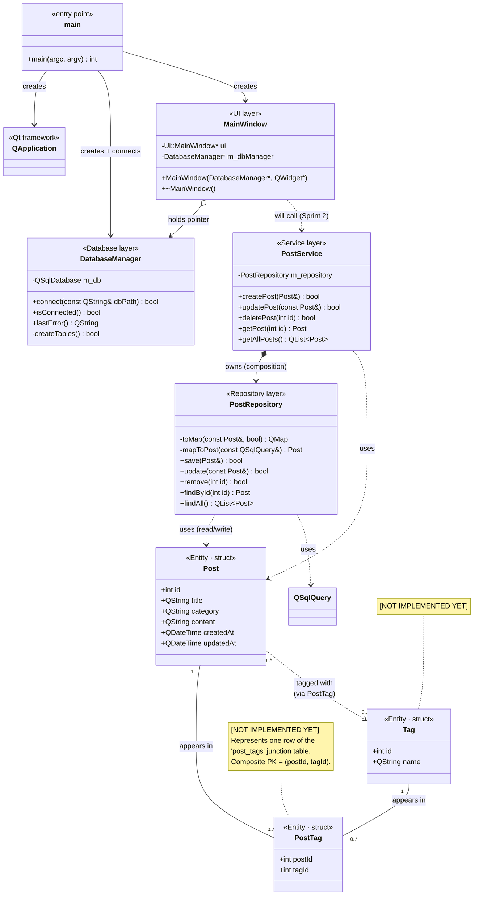
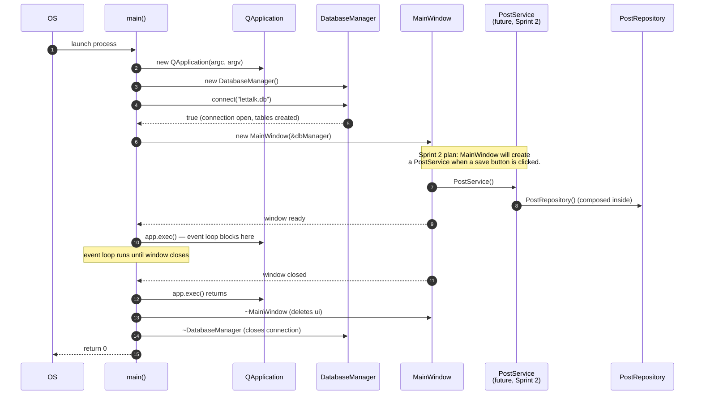
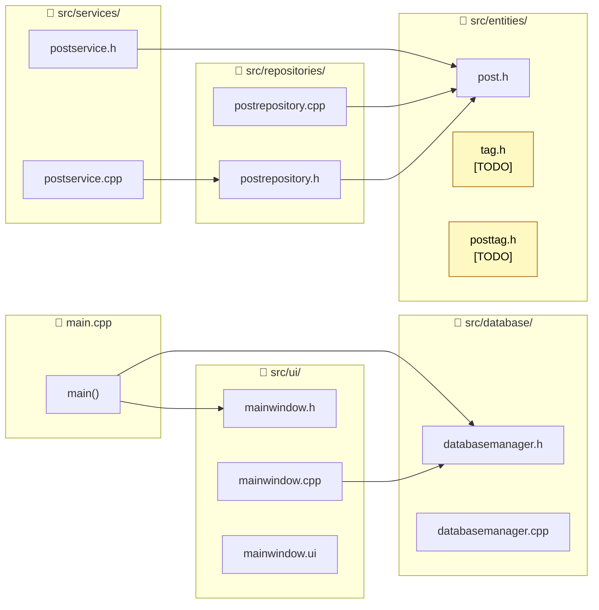

# 3. Class Diagram — Who Knows Whom

This is the static structure of the application: the C++ classes, their members, and
*who holds a pointer or reference to whom*. Use it as your map when you open the codebase.

---

## 3.1 The full UML class diagram

> 💡 **Why `PostTag` is its own entity:** In UML, a many-to-many association can be drawn as a
> direct line between `Post` and `Tag`. But because the database stores it as a real table
> (`post_tags`), the **Repository layer needs a real C++ type** to read/write those rows.
> `PostTag` is that type — a tiny `struct { int postId; int tagId; }`. The dotted
> `Post ..> Tag : tagged with (via PostTag)` line preserves the *conceptual* many-to-many
> relation, while the two solid lines show the *physical* implementation through the
> junction.

### Reading the arrows

| Notation | Meaning | Example here |
|----------|---------|--------------|
| `-->` solid | "creates" / "calls" | `main → DatabaseManager` (main creates it) |
| `o-->` aggregation | "holds a reference, but does not own its lifetime" | `MainWindow o→ DatabaseManager` (the pointer is passed in; main owns it) |
| `*-->` composition | "owns — when I die, it dies" | `PostService *→ PostRepository` (the repository is a value member, destroyed with the service) |
| `..>` dependency | "uses as a parameter or return type" | `PostService ..> Post` |
| `-- "n..m" --` | UML multiplicity on an association | `Post "0..*" -- "0..*" Tag` |

> 💡 **C++ specific note:** In `PostService`, the field is declared as
> `PostRepository m_repository;` — a *value*, not a pointer. That is **composition**: the
> repository lives and dies with the service. Contrast `MainWindow` which holds
> `DatabaseManager* m_dbManager` — a raw pointer it does **not** own.

---

## 3.2 Object lifetimes — who creates what, when

The takeaway: **`DatabaseManager` lives for the whole app lifetime**. The repository and
service can come and go (created on demand inside the UI). The database connection persists.

---

## 3.3 Where each file fits

The `#include` chains in the code mirror the architecture: a header only includes things
from its own layer or **the layer below**.

---

## 3.4 Quick reminders about C++ syntax in this codebase

If something in the code surprises you, this section probably explains it.

| You see…                              | What it means                                                                 |
|---------------------------------------|-------------------------------------------------------------------------------|
| `class Foo { public: ... private: ... }` | A class. Methods/fields are private by default.                            |
| `struct Foo { int x; };`              | Same as a class, but public by default. Used for pure data.                  |
| `Foo()`                               | Default constructor.                                                          |
| `Foo() = default;`                    | "Generate the default constructor for me, compiler."                         |
| `~Foo() override;`                    | Destructor. `override` means: I'm overriding a virtual method from a parent. |
| `const Foo& bar`                      | A *reference* to a `Foo`, **read-only**. No copy is made.                    |
| `Foo* ptr`                            | A raw pointer. Can be `nullptr`. The owner must `delete` it. (Qt's parent-child system handles this for `QObject`s.) |
| `m_xxx`                               | Convention: "member variable". Helps distinguish fields from local variables.|
| `: m_field(value)`                    | Member initializer list — preferred way to set fields in a constructor.      |
| `Q_OBJECT`                            | A Qt macro that enables signals/slots and reflection for a class. Required in every QObject subclass. |
| `forward declaration` `class DatabaseManager;` in `mainwindow.h` | A promise to the compiler that this class exists — lets you use `DatabaseManager*` without `#include`ing its full header. Speeds up compilation. |

---

➡️ Next: [`04-flows.md`](04-flows.md) — what happens at runtime when the user clicks a button.
