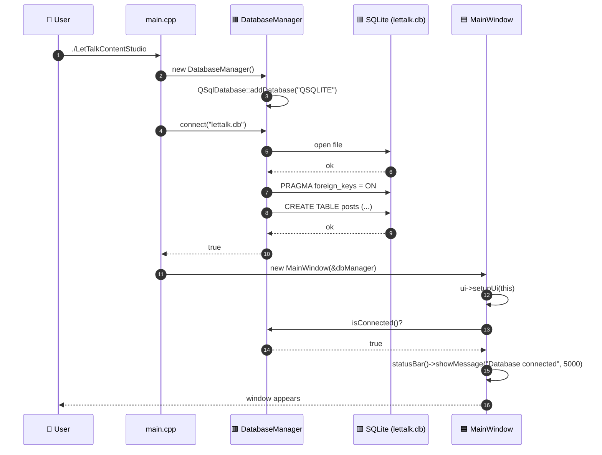
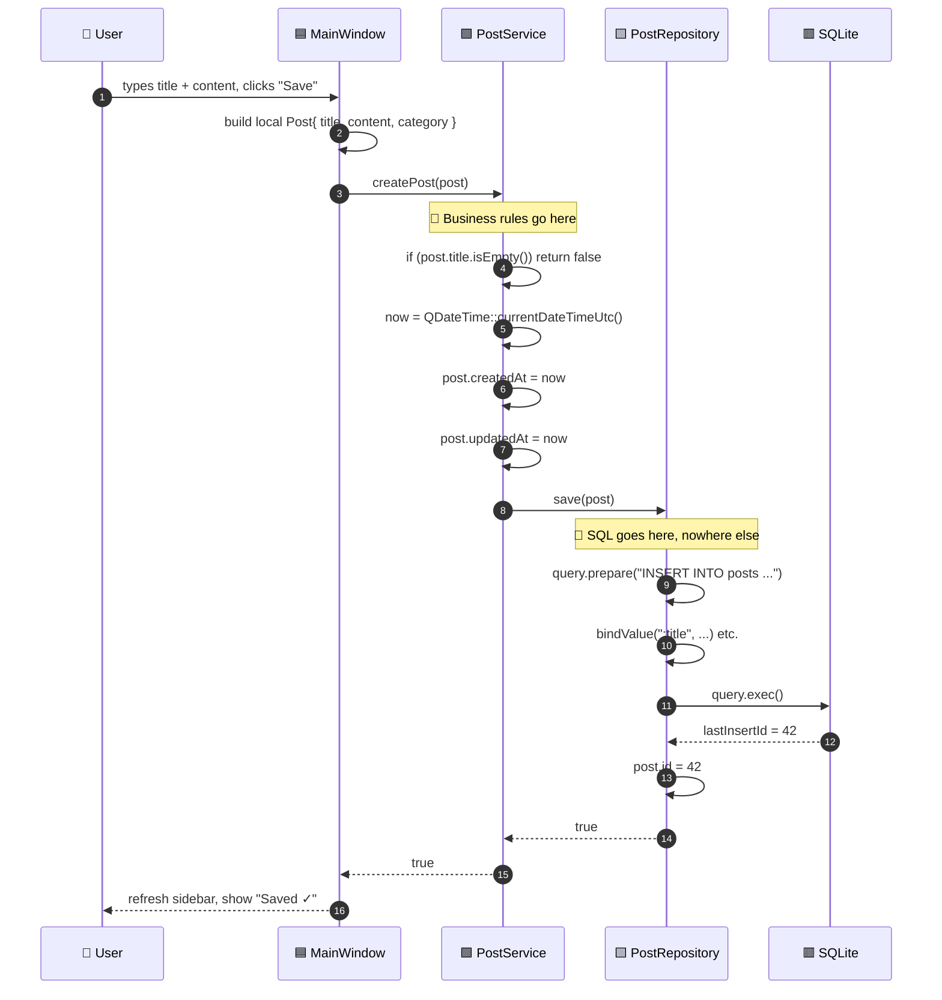
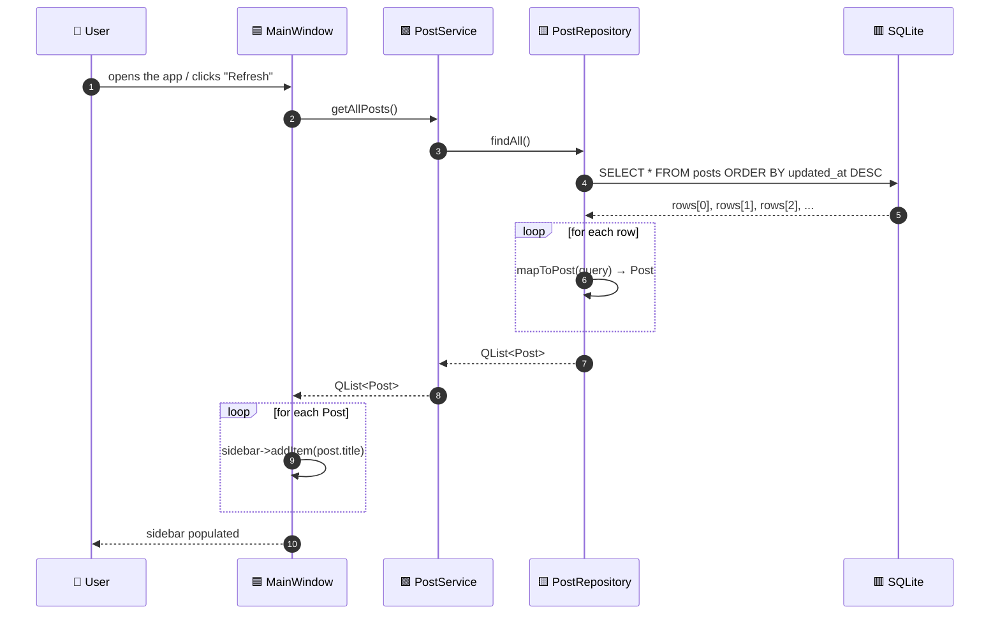
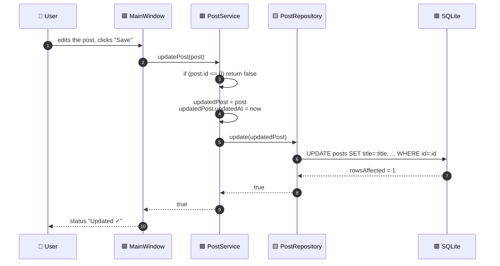
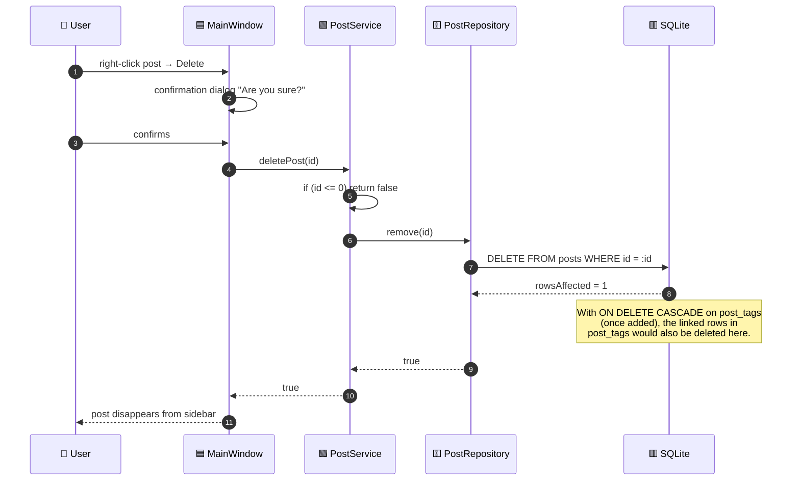
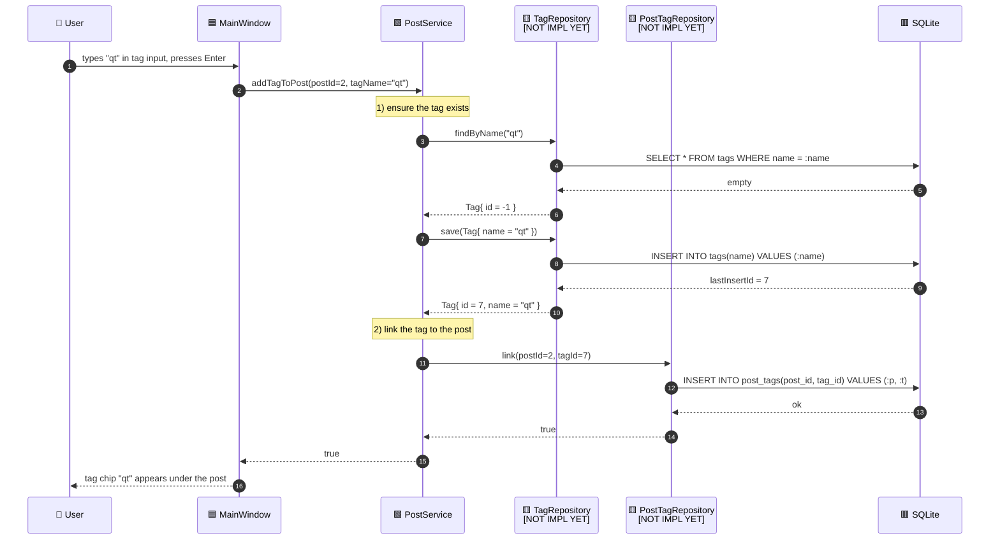
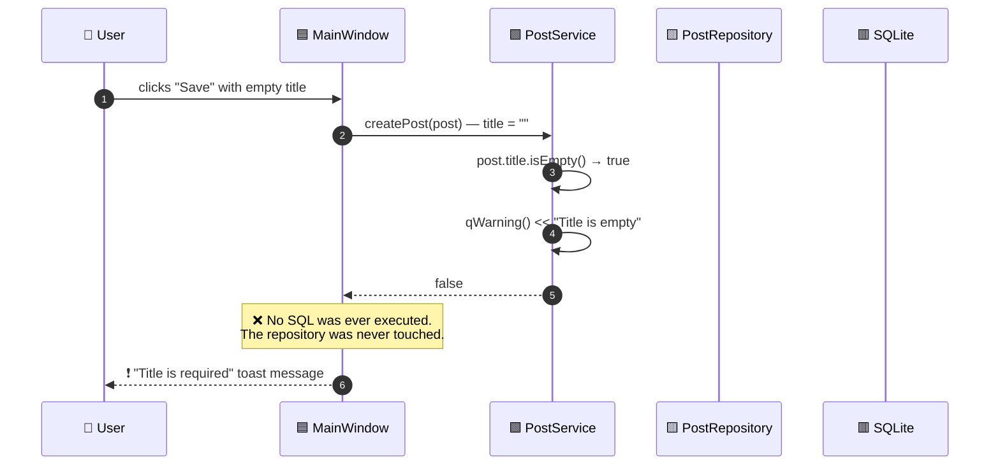

# 4. Runtime Flows — Following the Data

The class diagram in [`03-class-diagram.md`](03-class-diagram.md) shows the **static** picture.
This document shows the **dynamic** picture: how a user action travels through the layers
at runtime.

Every flow below uses the same color code:
- 🟦 UI · 🟩 Service · 🟨 Repository · 🟥 Database · 🟪 Entity

---

## 4.1 Flow A — Application startup

What you actually see on screen: a window pops up with the title bar
*"LetTalk Content Studio"* and a green status message at the bottom for 5 seconds.

---

## 4.2 Flow B — Creating a new post (the most important flow)

This is the flow Daniel should know **by heart**. Every other write operation looks similar.

> 💡 **Why is `post` passed by reference (`Post &post`) instead of by value?**
> Because the repository writes the new database-generated `id` back into the object
> (`post.id = query.lastInsertId().toInt()`). If we passed by value, the caller would
> never see the new id — they'd hold a copy with `id = -1`. Passing by reference is a
> deliberate "out parameter" pattern here.

> 📘 **Want to see this with real values at every step?** Open
> [`05-end-to-end-example.md`](05-end-to-end-example.md) — it follows one specific post
> ("My first Linux post") from the form on screen all the way into the SQL tables, showing
> exactly what the `Post` struct contains at each layer.

---

## 4.3 Flow C — Listing all posts (read flow)

Notice the Service is a **pass-through** here — no business rule applies to a simple list.
That's fine. Not every Service method needs to be clever; the value of the Service is *being
the consistent entry point*, even when it has nothing extra to do today.

---

## 4.4 Flow D — Updating an existing post

> 💡 **Why does the Service create a local copy `updatedPost`?**
> Because the parameter is declared `const Post &post` — promising the caller "I won't
> modify your object". To set `updatedAt`, we make a non-const copy. This is a common C++
> pattern: signal const-correctness at the interface, but mutate internally.

---

## 4.5 Flow E — Deleting a post

---

## 4.6 Flow F — Tagging a post (planned, Sprint 3)

This flow does **not exist in code yet**. It is shown here to illustrate how *one user action*
can require **multiple Repository calls** orchestrated by the Service. This is exactly the
kind of complexity the Service layer was invented for.

Watch what the Service is doing: **two repositories, one transaction-like operation**, all
hidden from the UI. The UI only knows "addTagToPost". This is the *real* payoff of the
layered design.

---

## 4.7 Flow G — A failure path (what happens when things go wrong?)

The Service guards the Repository from invalid data. The Repository never has to think
about "is this title empty?" — by the time a `Post` reaches it, it has already passed
validation.

---

## 4.8 Putting it all together — the mental model

When you read the code and feel lost, ask yourself the **three questions of layered architecture**:

1. **Where is this happening?** Which folder, which class? UI / Service / Repository / DB?
2. **What does this layer owe to the layer above?** (UI owes "render+events"; Service owes "validated business operations"; Repository owes "row ↔ entity"; DB owes "persistence".)
3. **Where does the data go next?** A method call to the layer below, or a return up to the layer above. Never sideways, never skipping.

If you can answer those three questions for any line of code, you understand the architecture.

---

➡️ Done with the docs! Head back to the [index](README.md) — or open [`BOARD.md`](../BOARD.md) and pick the next task.
